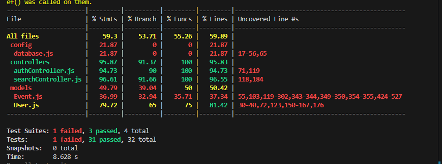

# Multi-User Event Locator Application

A robust backend application for locating events based on geospatial data, user preferences, and categories. This application demonstrates proficiency in Node.js, PostgreSQL with PostGIS, Redis for asynchronous notifications, and internationalization.

## Features

- **User Management**
  - Secure registration and authentication using JWT
  - User profile with location and language preferences
  - Category preferences for personalized event recommendations

- **Event Management**
  - Create, read, update, and delete events
  - Category tagging for events
  - Event reviews and ratings
  - Save events as favorites

- **Location-Based Search**
  - Find events within a specified radius of user's location
  - Filter events by categories, date range, and more
  - Get personalized event recommendations based on preferences

- **Multilingual Support**
  - Support for multiple languages (English, Spanish, French)
  - Localized error messages and notifications

- **Notification System**
  - Redis-based async notification queue
  - Event creation notifications for interested users
  - Event update notifications for users who saved the event
  - Scheduled reminders before events

- **API Documentation**
  - Interactive Swagger documentation
  - Detailed endpoint descriptions and examples
  - Easy testing of API endpoints

## Technologies Used

- **Backend Framework**: Node.js with Express
- **Database**: PostgreSQL with PostGIS for geospatial capabilities
- **Authentication**: JWT with bcrypt for password hashing
- **Validation**: express-validator for input validation
- **Internationalization**: i18next for multilingual support
- **Message Queue**: Redis Pub/Sub for async notifications
- **API Documentation**: Swagger UI and JSDoc
- **Testing**: Jest for unit testing

## Project Structure

```
event-locator/
├── config/                  # Configuration files
├── models/                  # Database models
├── controllers/             # Request handlers
├── routes/                  # API routes
├── services/                # Business logic
├── middleware/              # Custom middleware
├── utils/                   # Utility functions
├── locales/                 # Translation files
├── tests/                   # Test files
├── database/                # Database schema and migrations
├── .env                     # Environment variables
└── server.js                # Application entry point
```

## API Documentation

The API is documented using Swagger. Once the server is running, you can access the interactive API documentation at:

```
http://localhost:5000/api-docs
```

This provides:
- Detailed information about all endpoints
- Request/response schemas
- The ability to test API calls directly from the browser
- Authentication support for testing protected endpoints

## API Endpoints

### Authentication
- `POST /api/auth/register` - Register a new user
- `POST /api/auth/login` - Login user
- `GET /api/auth/me` - Get current user profile

### Users
- `PUT /api/users/profile` - Update user profile
- `PUT /api/users/preferences` - Update user category preferences
- `GET /api/users/preferences` - Get user category preferences
- `POST /api/users/favorites/:eventId` - Save event as favorite
- `DELETE /api/users/favorites/:eventId` - Remove event from favorites
- `GET /api/users/favorites` - Get user's favorite events
- `GET /api/users/notifications` - Get user notifications
- `PUT /api/users/notifications/:notificationId/read` - Mark notification as read
- `PUT /api/users/notifications/read-all` - Mark all notifications as read

### Events
- `POST /api/events` - Create a new event
- `GET /api/events` - Get all events with pagination
- `GET /api/events/:eventId` - Get a specific event
- `PUT /api/events/:eventId` - Update an event
- `DELETE /api/events/:eventId` - Delete an event
- `GET /api/events/category/:categoryId` - Get events by category
- `POST /api/events/:eventId/reviews` - Add a review to an event
- `GET /api/events/:eventId/reviews` - Get reviews for an event

### Search
- `GET /api/search/events` - Search for events based on location and filters
- `GET /api/search/nearby` - Get nearby events
- `GET /api/search/recommended` - Get recommended events based on user preferences

## Database Schema

The database schema includes the following tables:
- `users` - User profiles with authentication info and location
- `categories` - Event categories
- `events` - Event details including geospatial location
- `event_categories` - Junction table for events and categories
- `user_category_preferences` - Junction table for users and their preferred categories
- `reviews` - Event reviews and ratings
- `saved_events` - Users' favorite events
- `notifications` - User notifications

## Setup and Installation

### Prerequisites
- Node.js (v14+)
- PostgreSQL with PostGIS extension
- Redis server

### Installation Steps

1. Clone the repository
   ```
   git clone https://github.com/yourusername/event-locator.git
   cd event-locator
   ```

2. Install dependencies
   ```
   npm install
   ```

3. Create a `.env` file based on `.env.example`
   ```
   cp .env.example .env
   ```

4. Set up the PostgreSQL database
   ```
   psql -U postgres -c "CREATE DATABASE event_locator"
   psql -U postgres -d event_locator -c "CREATE EXTENSION postgis"
   ```

5. Run the database schema script
   ```
   psql -U postgres -d event_locator -f database/schema.sql
   ```

6. Start the server
   ```
   npm start
   ```

7. Access the API documentation at `http://localhost:5000/api-docs`

## Testing

Run the test suite with:
```
npm test
```


## Future Enhancements

- Real-time event updates using WebSockets
- Integration with external mapping services
- Mobile app with push notifications
- OAuth authentication for social login
- Advanced search with more filters
- Event registration and ticketing